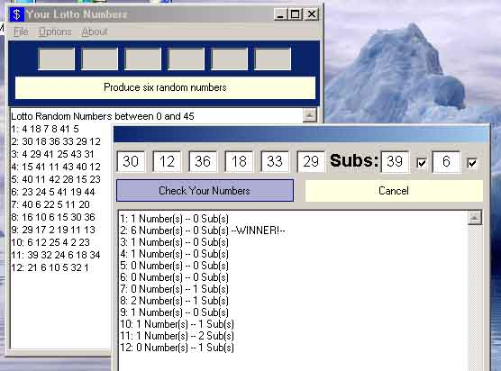



## Advanced Lotto Program

### Description

This is the second version of my lotto program with many added features.

1. Check your numbers add-on. So this tell you how many numbers you have the same. As well there is a choice of having one or two subs to suit your lotto.

2. The ability to choose how many random numbers you want.

3. The ability to choose what you want to the numbers to be between.

4. An option of having the numbers ordered from lowest to highest or highest to lowest or unordered.

5. Print,Open and save options.

6. Ability to change font and styles, as well copying and clearing options.

7. Also a powerball option. Which is one form of lotto I have in my country, Australia.

Altogether with these options you can customise my program to suit your lotto in your country. Please vote for the program if you like it. Make sure you read the readme file. Thats what it is there for.
 
### More Info
 

             |
---                |---
**Submitted On**   |2001-10-10 09:22:08
**By**             |[simmato](https://github.com/Planet-Source-Code/PSCIndex/blob/master/ByAuthor/simmato.md)
**Level**          |Intermediate
**User Rating**    |4.8 (24 globes from 5 users)
**Compatibility**  |VB 4\.0 \(32\-bit\), VB 5\.0, VB 6\.0
**Category**       |[Complete Applications](https://github.com/Planet-Source-Code/PSCIndex/blob/master/ByCategory/complete-applications__1-27.md)
**World**          |[Visual Basic](https://github.com/Planet-Source-Code/PSCIndex/blob/master/ByWorld/visual-basic.md)
**Archive File**   |[Advanced L282641092001\.zip](https://github.com/Planet-Source-Code/simmato-advanced-lotto-program__1-27952/archive/master.zip)

